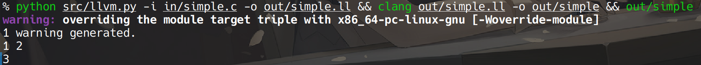
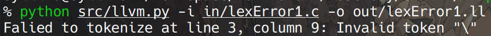
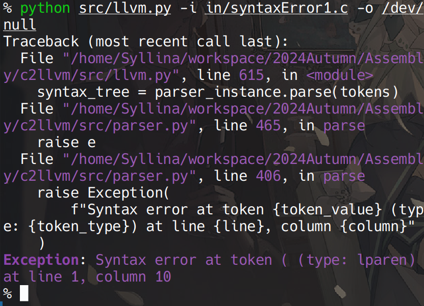
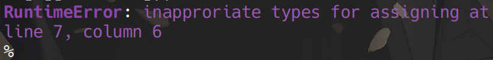
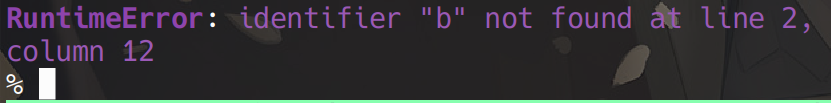
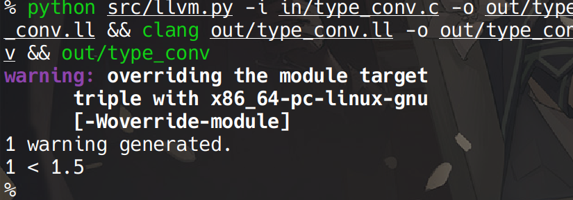

# c2llvm
2024 汇编与编译原理 小组作业 C -> LLVM

## 功能模块

本项目能将简单的 C 代码翻译为 LLVM IR（中间表示），并可进一步利用 clang 编译至可执行文件.

### 词法分析

该部分代码位于 `src/lexer.py`.

本部分对 C 代码进行词法分析，将原始代码转化为 token 流，并在 token 中记录其行列号等相关信息.

### 语法分析

该部分代码位于 `src/parser.py`，语法规则定义于 `src/syntax.py`.

语法规则在 python 代码中定义，格式如下：

```python
rules = {
    "PROGRAM": {
        "name": "PROGRAM",
        "rules": [
            [
                "OUTER_STMT",
                "OUTER_SUB_PROGRAM"
            ],
            [
                "OUTER_STMT"
            ]
        ]
    },
    # ......
}
```

其中，规则保存在rules字典当中，每个键是一个非终结符，值是一个字典，包含name和rules（name是非终结符的名称，存在空名称，用于简化语法树的生成；rules是一个二维列表，每个元素是一个产生式，产生式是一个列表，每个元素是一个非终结符或终结符）。

Parser类实现了一个LR(1)语法分析器，用于将Token序列解析为语法树。

与编译小作业内容类似：首先构建LR(1)分析表，初始化状态栈、符号栈、语法树栈。接着读取Token序列，在每一步中读取当前状态和下一个Token的类型，并根据Action表，进行移进、规约、接收、错误的操作。

** 语法分析部分可单独运行 **，其运行方式如下：

```shell
usage: parser.py [-h] (-t | -i INPUT) [-o OUTPUT]
  -t, --test            使用样例程序测试语法分析器
  -i INPUT, --input INPUT
                        输入文件路径
  -o OUTPUT, --output OUTPUT
                        输出文件路径
```

### 代码翻译

该部分代码位于 `src/llvm.py`

本部分调用了词法与语法分析器，并利用 `llvelite` 所提供的 `llvm` 中间层，将语法分析器给出的 AST 翻译为 llvm IR，在 llvm 环境下可进一步翻译为可执行程序. 对于存在语义错误的程序，该部分会利用词法分析中保存在 token 中的行列号等信息给出相应的错误提示.

## 核心功能展示

### 基础代码翻译

以下是一段基础的 C 语言代码，存放于 `in/simple.c` 中

```c
#include <stdio.h>

int main() {
    int a;
    int b;
    scanf("%d%d", &a, &b);
    printf("%d\n", a + b);
    return 0;
}
```

安装相关依赖并在 Linux 系统终端运行如下指令后，可以执行这段代码，用户在终端输入 `1 2` 后能得到正确的输出 `3`，执行效果如图



```shell
python src/llvm.py -i in/simple.c -o out/simple.ll && clang out/simple.ll -o out/simple && out/simple
```

其中 llvm IR 生成于 `out/simple.ll` 中，其内容如下
```
; ModuleID = "undefined"
target triple = "unknown-unknown-unknown"
target datalayout = ""

declare i32 @"scanf"(i8* %".1", ...)

declare i32 @"printf"(i8* %".1", ...)

define i32 @"main"()
{
body:
  %"a" = alloca i32
  %"b" = alloca i32
  %".2" = bitcast [5 x i8]* @".1" to i8*
  %".3" = call i32 (i8*, ...) @"scanf"(i8* %".2", i32* %"a", i32* %"b")
  %".4" = load i32, i32* %"a"
  %".5" = load i32, i32* %"b"
  %".6" = add i32 %".4", %".5"
  %".7" = bitcast [4 x i8]* @".2" to i8*
  %".8" = call i32 (i8*, ...) @"printf"(i8* %".7", i32 %".6")
  ret i32 0
}

@".1" = unnamed_addr constant [5 x i8] c"%d%d\00"
@".2" = unnamed_addr constant [4 x i8] c"%d\0a\00"
```

### 回文串

回文串检测的代码在 `in/palindrome.c` 中，其接受一个长度适当的字符串，若该字符串为回文串，则输出 True，否则输出 False. 代码中使用了 `while` 循环，数组访问，`if` 判断语句等功能，执行效果如下：

!(palindrome 执行效果)[images/palindrome.png]

### 双端冒泡排序

双端冒泡排序的代码在 `in/doubleBubbleSort` 中，其接受一个用逗号隔开的整数数组，并应用双端冒泡排序算法对其进行排序，其中用到了循环嵌套与条件判断语句等功能.

!(bubble 执行效果)[images/bubble.png]

## 词法、语法和语义错误检测

### 词法错误

如下存在非法字符的代码无法通过词法分析（`in/lexError1.c`）
```c
#include <stdio.h>

int main(\\) {
    return 0;
}
```

运行结果如图



### 语法错误

如下不符合 C 语言语法的代码无法通过语法分析（`in/syntaxError1.c`）
```c
int main()() {
    return 0;
}
```

运行结果如图



### 语义错误

下面给出的代码将返回值为 `void` 的函数传递给了 `int` 类型的变量，使得翻译器报错.
```c
void func(int f) {
    return;
}

int main() {
    int a;
    a = func(1);

    return 0;
}
```

运行结果如图



下面给出的代码使用了未定义的标识符，翻译器报错

```c
int main() {
    int a = b + c;
}
```

运行结果如图



## 难点和创新点

### 类型转换

`in/type_conv.c`

```c
#include <stdio.h>

int main() {
    int a = 1.5;
    if (a < 1.5) {
        printf("%d < 1.5\n", a);
    }
    return 0;
}
```

C 语言中将 1.5 赋值给 `int` 类型变量 `a` 时会进行隐式类型转换，`a` 的值实际应为 1.

代码运行结果如下：

